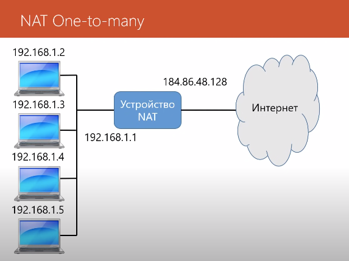
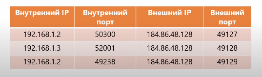

# Технологии
## NAT
NAT(Network Address Translation) - трансляция сетевых адресов.
Технология NAT позволяет преобразовывать IP-адреса внутренней(частной) сети в IP-адреса внешней сети(Интернет). Целью ее создания является нехватка IP-адресов IPv4.

> Напоминание о _внутренних_ и _внешних_ IP-адресах. Внутренним IP-адресом является диапазон частных сетей: 10.0.0.0/8, 172.16.0.0/12, 192.168.0.0/16. Внешним IP-адресом является уникальный адрес зарегистрированный в ICANN. 

Типы NAT:
+ Статический - отображение IP-адресов идет один к одному
+ Динамический - отображение внутренних IP-адресов на группу внешних IP-адресов
+ Один ко многим - отображение внутренних IP-адресов на один внешний адрес  

Преобразования выполняются с помощью ***таблицы NAT***, использую комбинацию IP-адрес + Порт:

## Межсетевой экран(Firewall)
Межсетевой экран - это устройство или программа, которая отделяет сеть от других сетей. Межсетевой экран работает на транспортном и сетевом уровне.

**Как работает межсетевой экран?**
Межсетевой экран перехватывает все пакеты которые приходят из внешней сети, с помощью _таблицы правил_ он проверяет заголовки сетевого и транспортного уровня, далее принимает решение отправлять пакет дальше или отбросить.

**Другие методы ограничения:**
+ Канальный уровень - фильтрация на портах коммутатора по MAC-адресам
+ Прикладной уровень - фильтрация с помощью proxy server и content filter
+ Система обнаружения вторжений - IDS
+ Система предотвращений вторжений - IPS